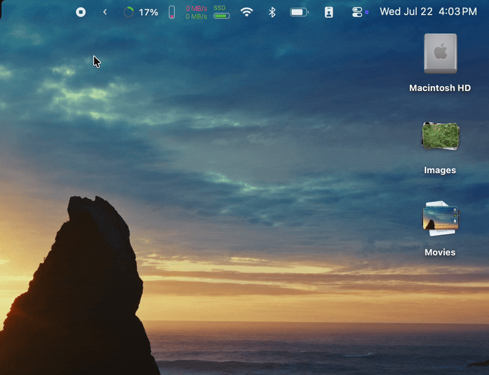
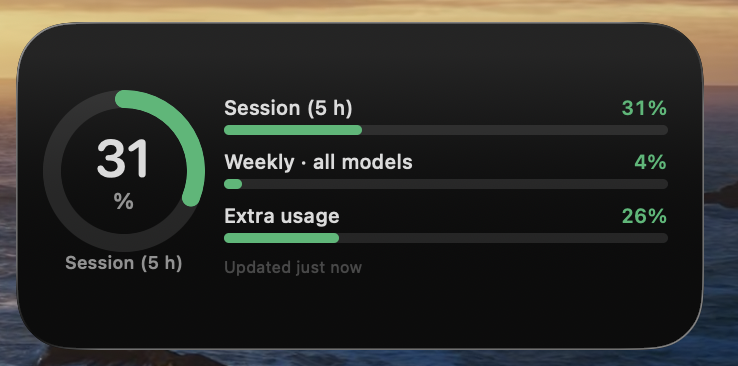
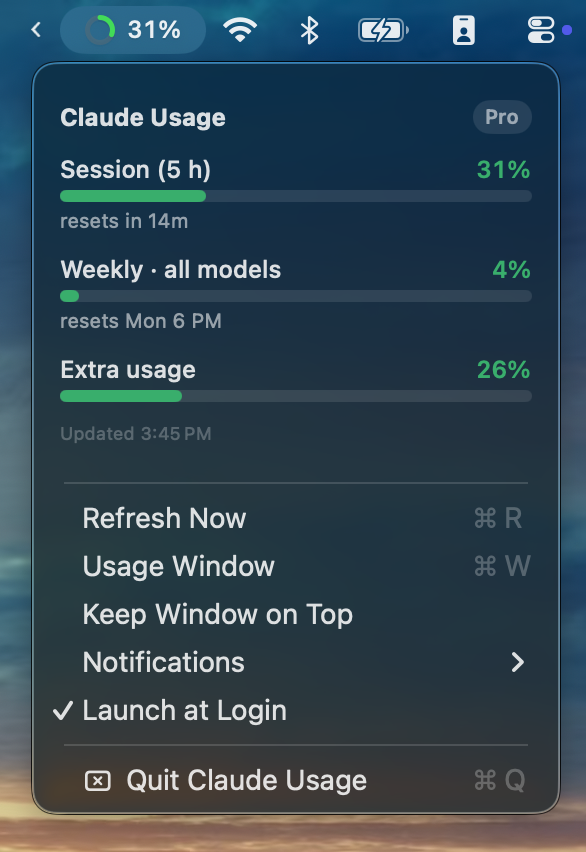
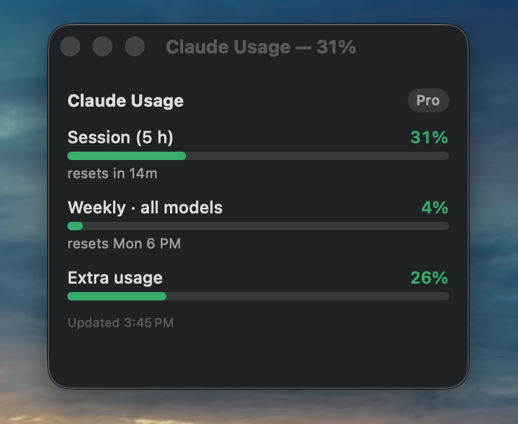

# Claude Usage

> Watch your Claude usage limits from the macOS menu bar, a desktop widget, and
> a status window — the same numbers as Claude Code's `/usage`, always in view.

[](https://github.com/jpuritz/ClaudeUsageBar/releases)
[](https://github.com/jpuritz/ClaudeUsageBar/releases/latest)
[](LICENSE)




> **Unofficial** — not affiliated with or endorsed by Anthropic. It reads *your*
> Claude Code sign-in from your Keychain and talks only to Anthropic's servers.
> No telemetry. [What that means ↓](#how-it-works)

**Requires:** macOS 14+, an active Claude subscription, and the
[Claude Code CLI](https://code.claude.com) signed in.

## Contents

- [Features](#features)
- [Install](#install)
- [Screenshots](#screenshots)
- [Menu options](#menu-options)
- [Building from source](#building-from-source)
- [How it works](#how-it-works)
- [Architecture](#architecture)

## Features

- **Menu bar** — a colored ring and your 5-hour session percentage; click for
  every limit with reset countdowns.
- **Desktop widget** — a real WidgetKit widget (small / medium / large) in the
  system widget gallery, with native styling.
- **Usage window** — the full breakdown in a normal window: resizable, remembers
  its position, and can float on top.
- **Live Claude service status** — a colored line in the menu and an incident dot
  on the ring when claude.ai, Claude API, Claude Code, or Claude Console is
  disrupted.
- **Notifications** — 80% / 95% thresholds, reset alerts, burn-rate "on pace to
  run out" warnings, and service up/down alerts. Each independently toggleable.
- **Stays signed in** — renews the Keychain token automatically, so you rarely
  need to run `/login` again.
- **Global shortcut** (⌘⇧U) opens the window from anywhere — no Accessibility
  permission required.
- **Configurable refresh** (15 s – 2 min), plus an instant refresh when your Mac
  wakes from sleep.

## Install

### Homebrew (recommended)

```sh
brew install --cask --no-quarantine jpuritz/tap/claude-usage
```

The `--no-quarantine` flag matters: the build is ad-hoc signed, and without it
Gatekeeper blocks the first launch.

### Manual download

Grab `ClaudeUsage-menubar.zip` from the
[latest release](https://github.com/jpuritz/ClaudeUsageBar/releases/latest),
unzip, and drag **Claude Usage.app** to `/Applications`. Then clear quarantine
once (ad-hoc signing again):

```sh
xattr -dr com.apple.quarantine "/Applications/Claude Usage.app"
```

Or open it via right-click ▸ Open, then System Settings ▸ Privacy & Security ▸
*Open Anyway*.

> **Want the desktop widget?** The download is the **menu bar + window** build.
> The widget can't be distributed for free — it needs an App Group entitlement,
> which needs a paid Apple Developer account — so it's **build-from-source**
> (free, but requires Xcode). See [Building from source](#building-from-source).

### First launch

macOS will ask to access *Claude Code-credentials* — click **Always Allow**.
That token is what the app reads to fetch your usage; denying it leaves the app
with nothing to show.

## Screenshots

**Desktop widget** — medium size shown; small and large also available:



**Menu bar** — ring and session percentage, with the full breakdown and controls
on click:



**Usage window** — resizable, remembers its frame, and can float on top:



## Menu options

- **Claude service status** — top line, colored; click to open status.claude.com.
  Watches claude.ai, Claude API, Claude Code, and Claude Console.
- **Refresh Now** (⌘R while the menu is open)
- **Usage Window** (⌘W) — show/hide the detail window
- **Keep Window on Top** — pin that window above other apps
- **Notifications** submenu:
  - *Alert at 80% and 95%* — banner when a limit crosses those thresholds
  - *Alert When Limits Reset* — scheduled for the reset time of any limit ≥ 60%,
    so it fires even if the Mac was asleep at reset time
  - *Usage Pace Warnings* — burn-rate projection over the last hour; warns once
    per window if you're on pace to hit 100% before the reset arrives
  - *Claude Service Alerts* — banner when a watched service goes down or recovers
- **Refresh Interval** — 15 s / 30 s / 1 min / 2 min (default 30 s)
- **Global Shortcut (⌘⇧U)** — open the usage window from anywhere; off by default.
  Uses Carbon hotkeys, so **no Accessibility permission** is needed.
- **Launch at Login** — via `SMAppService` (also toggleable in
  System Settings → General → Login Items)
- **Quit Claude Usage**

The app also refreshes immediately when the Mac wakes, so the first reading after
sleep isn't stale.

## Building from source

Two paths, depending on whether you want the WidgetKit widget.

### With the widget (needs Xcode)

```sh
brew install xcodegen
./build-widget.sh          # builds app + widget, installs to /Applications
```

First time only, before that script will succeed:

1. Install **Xcode** (not just Command Line Tools) and point the tools at it:
   `sudo xcode-select -s /Applications/Xcode.app`
2. **Xcode ▸ Settings ▸ Accounts ▸ "+" ▸ Apple ID** and sign in. A *free* Apple ID
   works — no paid developer account.
3. Generate and open the project, then pick your Team:
   ```sh
   xcodegen generate && open ClaudeUsage.xcodeproj
   ```
   Select the **ClaudeUsage** target ▸ Signing & Capabilities ▸ **Team**, then do
   the same for the **ClaudeUsageWidget** target. Xcode creates your development
   certificate at that moment.
4. Run `./build-widget.sh`. From here on it's fully command-line — it finds your
   team automatically.

Then add the widget: right-click the desktop ▸ **Edit Widgets** ▸ search
"Claude Usage" ▸ drag out the size you want.

The Apple ID is required because the app and widget are separate processes that
share data through an **App Group**, and that entitlement can't be ad-hoc signed.
The Xcode project is generated from [`project.yml`](project.yml) by XcodeGen, so
edit that rather than the `.xcodeproj` (which is gitignored).

<details>
<summary>Widget build troubleshooting</summary>

- *"has entitlements that require signing with a development certificate"* — no
  Team selected yet; do step 3 above.
- *"invalid or unsupported format for signature"* — stale build artifacts. Run
  `rm -rf build/dd` and rebuild.
- *Widget doesn't appear in the gallery* — it's registered from the installed
  copy, so the app must be in `/Applications`. Confirm with
  `pluginkit -mv -p com.apple.widgetkit-extension | grep claude`.
- *Widget shows old data* — make sure only the `/Applications` copy is running.
  An ad-hoc `build.sh` copy in `~/Applications` can't write the shared snapshot.

</details>

### Without the widget (Command Line Tools only)

No Xcode, no Apple ID. Menu bar and usage window work fully; there's just no
widget.

```sh
./build.sh              # ad-hoc signed, installs to ~/Applications
./build.sh --package    # …and also produces build/ClaudeUsage-menubar.zip
```

This is what the published release contains.

## How it works

The app reads the OAuth token that Claude Code stores in your login Keychain
(`Claude Code-credentials`) and polls `api.anthropic.com/api/oauth/usage` — the
same undocumented endpoint that powers Claude Code's `/usage` — every 30 seconds,
with `Retry-After`-aware backoff on 429s.

**Privacy.** It *reads* (never writes) that token and sends it to exactly one
place: `api.anthropic.com`. The token is never logged, displayed, or sent to any
third party. There's no telemetry and no network activity beyond the Anthropic
API and the local `claude` CLI. The relevant code is short — see
[Sources/Keychain.swift](Sources/Keychain.swift) and
[Sources/UsageModel.swift](Sources/UsageModel.swift).

**Two things to know.** Because it uses an *undocumented* endpoint, Anthropic can
change or remove it at any time and the app would break. And it identifies itself
as `claude-code/<version>`, because that endpoint rejects unrecognized
User-Agents — it reads only your own data, with your own credentials.

**Keeping you signed in.** Access tokens last ~8 hours. The app can't refresh
them directly, but a real CLI call does — so on a 401 it runs a tiny
`claude -p "hi" --model haiku --no-session-persistence`, which makes the CLI
renew the Keychain token, then retries. This fires ~3× a day for a negligible
number of tokens (rate-limited to one call per 5 minutes). Only if that fails
does it ask you to run `claude` → `/login`.

<details>
<summary>Approaches that do NOT work (so nobody repeats them)</summary>

- **Calling the OAuth refresh endpoint from the app.**
  `platform.claude.com/v1/oauth/token` returns a persistent 429 to non-browser
  clients — it never clears, and behaves identically via `URLSession` and `curl`
  (with or without HTTP/1.1). Looks like bot protection, not a rate limit.
- **`claude auth status`.** Reports only locally-stored state and never hits the
  network — it returns `loggedIn: true` even when the stored token is long dead.
- **`claude setup-token` long-lived tokens.** Scoped for the Anthropic API, not
  the `/oauth/usage` endpoint, so they're rejected with 401. (The app will prefer
  a token placed in a `ClaudeUsage-token` Keychain item if you add one, but this
  isn't a working path today.)
- **Timezone gotcha when debugging:** the Keychain's `expiresAt` is a Unix
  timestamp that most tooling renders in *local* time. Print both zones when
  comparing against expiry, or you'll chase failures that haven't happened yet.

</details>

## Architecture

```
Sources/   host app (menu bar, window, fetching, notifications, status)
Widget/    WidgetKit extension
Shared/    model + formatting compiled into BOTH targets
Config/    Info.plists and entitlements
```

The host app is deliberately **not sandboxed** — it reads the Claude Code
Keychain item and spawns the `claude` CLI, neither of which a sandboxed process
can do. Widget extensions, by contrast, *must* be sandboxed. So they can't share
memory or arbitrary files: the app writes a JSON snapshot into the shared App
Group container and calls `WidgetCenter.reloadAllTimelines()`; the widget only
ever reads that snapshot and never touches your credentials.

The app pushes a widget reload on every poll (~30 s), but macOS throttles and
coalesces widget refreshes on its own schedule, so the widget updates less often
than that in practice — every view shows an "updated Xm ago" stamp rather than
implying the number is live. The menu bar, drawn directly by the app, is the one
that tracks the full cadence.

**Details worth knowing:**

- Colors: green < 50%, yellow < 75%, orange < 90%, red ≥ 90%.
- The menu bar and widget headline show the **5-hour session** limit (the one
  that bites mid-session), falling back to the highest limit if absent. The menu,
  window, and medium/large widgets list every limit.
- The usage parser is generic: if Anthropic adds a new limit, it appears
  automatically — no code change needed.

## License

[MIT](LICENSE) © Jon Puritz
